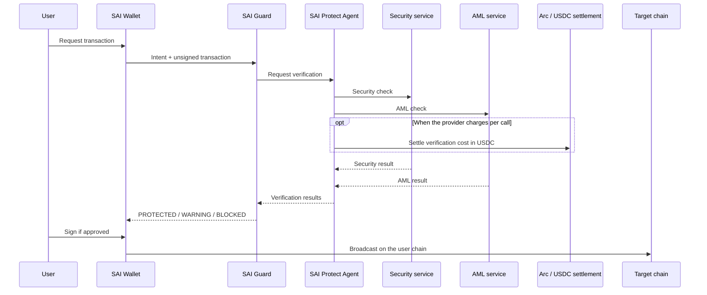

**Proposed.** Nothing in the current SAI Guard repository talks to Arc, Circle APIs, or x402.

Arc is **not** the chain on which the protected user transaction must execute. The user transaction can be on Ethereum, TRON, BNB Chain, Base, Arbitrum, Solana, or another supported network.

```text
Protected transaction chain  ≠  Verification settlement chain
```

Example: user sends USDT on TRON. TRON executes the payment. Arc, if used, is where the SAI Protect Agent pays independent security / AML / verification services in USDC.

## Why Arc is in the architecture

Circle’s **Arc** L1 uses **USDC as the native gas token** (EVM, with an ERC-20 interface; see [Arc contract references](https://docs.arc.io/arc/references/contract-addresses)). That makes small USDC transfers a natural unit for machine payments, without a separate gas token for the settlement leg.

Arc is the **preferred** agentic settlement layer in this design. It is not technically mandatory. Settlement providers can evolve.

## What belongs where

| System | Role in SAI Guard docs |
| --- | --- |
| **SAI Guard** | Verification protocol and Risk Engine |
| **Arc** | Blockchain where USDC is native; optional home for agent operating wallets and (later) receipt anchors |
| **x402** | Open HTTP `402 Payment Required` protocol ([spec](https://github.com/coinbase/x402)) — not an Arc feature |
| **Circle Gateway / nanopayments** | Circle product that batches off-chain EIP-3009 authorizations and can settle x402; Arc Testnet is one supported network (`eip155:5042002` in Circle’s Gateway docs) |
| **Circle wallets / Agent Stack** | Circle account and wallet infrastructure — not “the Arc chain” |

Do not attribute Gateway, x402, or Circle Wallets to Arc itself.

## Architecture

```text
User Transaction
ETH / TRON / BSC / SOL / etc.
             │
             ▼
      SAI Protect Agent
             │
      requires checks
             │
     ┌───────┼─────────┐
     ▼       ▼         ▼
 Security   AML    AI Verifier
     │       │         │
     └───────┼─────────┘
             │
        USDC payments (optional Arc / x402 / API invoice)
             │
             ▼
       verification results
             │
             ▼
        SAI Guard Risk Engine
```



Payment may happen before or after the result depending on the provider (prepay vs 402-retry). Implementers must not assume a single ordering. The diagram is the target agent-native flow, not a deployed system.

## SAI Protect operational wallet

Isolated wallet for verification spend, conceptually:

```text
Network: Arc
Asset: USDC
Allowed: registered verification / AML / security / AI verifier endpoints
Forbidden: user-fund transfers, trading, arbitrary withdraw
Caps: daily and per-request
```

This balance is **not** the user’s TRON/ETH wallet.

## x402 / pay-per-verification

**Proposed** on the SAI Guard side. [x402](https://www.x402.org) uses HTTP 402: the server returns payment requirements; the client retries with a payment payload; a facilitator verifies/settles.

Target loop:

```text
SAI Protect Agent
       ↓
GET /security-check/0xABC
       ↓
HTTP 402 Payment Required
       ↓
agent pays (e.g. 0.003 USDC)
       ↓
security result
```

That can replace “API key + monthly invoice” with `discover → pay → verify → continue` **when the provider actually speaks x402**.

Do **not** claim GoPlus, TRM, AMLBot, Blockaid, or Tenderly support x402 unless their docs say so. SAI Guard should keep:

- traditional API credentials;
- agent-native paid APIs.

Circle Gateway documents nanopayments that make sub-cent x402 settlement viable via batched EIP-3009 authorizations, including Arc Testnet. That is Circle Gateway, optionally landing on Arc — not a SAI Guard runtime feature today.

[Circle Gateway nanopayments](https://developers.circle.com/gateway/nanopayments) · [x402 spec](https://github.com/coinbase/x402/blob/main/specs/x402-specification-v2.md)

## Arc Verification Registry

**Proposed / Future.** Merkle-root anchoring of verification-receipt hashes on Arc for tamper evidence. Not implemented. See [Receipts](/reference/receipts/).
