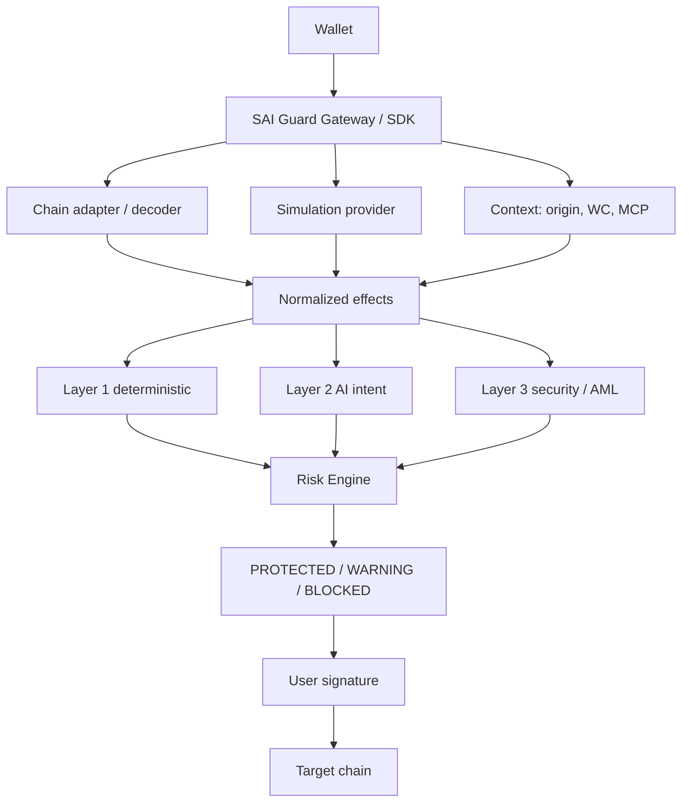

**In Development** for the protect path. The boxes below are the 2.0 architecture.

```text
                    SAI Wallet / External Wallet
                              │
                    Signing Request + Intent
                              │
                              ▼
                 ┌─────────────────────────┐
                 │   SAI Guard Gateway / SDK     │
                 └────────────┬────────────┘
                              │
              ┌───────────────┼─────────────────┐
              ▼               ▼                 ▼
        Transaction       Simulation       Context
          Decoder           Engine         Collector
              │               │                 │
              └───────────────┼─────────────────┘
                              ▼
                   Normalized Effects Model
                              │
             ┌────────────────┼─────────────────┐
             ▼                ▼                 ▼
       Security Agent     AML / Risk       AI Intent
                         Intelligence       Verifier
             │                │                 │
             └────────────────┼─────────────────┘
                              ▼
                   Deterministic Risk Engine
                              │
                 ┌────────────┼────────────┐
                 ▼            ▼            ▼
             PROTECTED      WARNING      BLOCKED
                              │
                              ▼
                         User Decision
                              │
                              ▼
                         User Signature
```



The wallet still signs on the **target chain** (Ethereum, TRON, Solana, …). SAI Guard does not move that execution onto Arc. Arc, when used, settles **verification-service** payments. See [Arc](/reference/arc/).

## Components

| Component | Job | Must not |
| --- | --- | --- |
| Wallet / dApp / agent | Construct unsigned tx + declared intent | Be the only source of “what this tx does” |
| SAI Guard Gateway / SDK | Orchestrate decode, simulate, verify, decide | Sign user transactions |
| Chain adapter | Decode and simulate for one family (EVM, TRON, Solana) | Leak chain-specific blobs into the public SDK |
| Normalized effects | Canonical asset deltas, approvals, internals | Trust producer-supplied effects without simulation |
| AI intent verifier | MATCH / MISMATCH / UNCERTAIN vs intent | Answer “is this safe?” |
| Security / AML providers | Reputation, phishing, sanctions, token risk | Be hardcoded as the only vendor |
| Risk Engine | Apply policy to structured results | Let an LLM skip a BLOCK rule |
| User | Final authorization | Be asked to sign hex they cannot relate to effects |

## Cross-chain adapters

```text
                  SAI Guard
                   │
        ┌──────────┼──────────┐
        ▼          ▼          ▼
       EVM        TRON      Solana
        │          │          │
   EVM Adapter  TRON Adapter Solana Adapter
        │          │          │
        └──────────┼────────────┘
                   ▼
          Normalized Effects
```

**Proposed** except a demo EVM `transfer` adapter in v0.1 (`evm-transfer-v1`). See [Networks](/reference/networks/).

## Public vs internal types

Integrators see intent, transaction, context, verdict, normalized effects, check map, warnings. Provider-native JSON stays behind adapters. Do not put a GoPlus or Tenderly response shape on the SAI Guard SDK.
