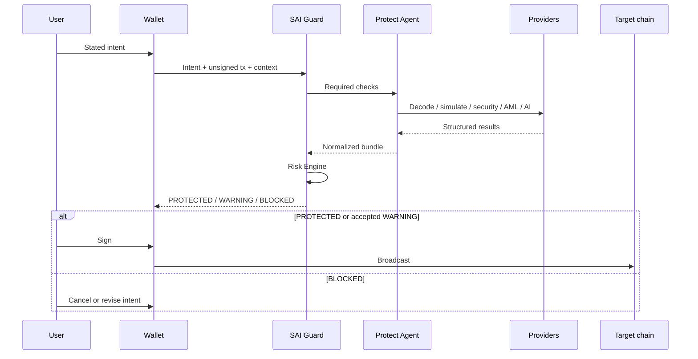

**In Development** as the protect lifecycle. v0.1 uses mandate → intent → proposal → attestations → gate → submit; see [From v0.1](/reference/migration/).

## Inputs

1. **Intent** — what the user asked (send, swap, approve, …) with assets, amounts, destination, min-out, chain.
2. **Transaction proposal** — unsigned payload (EVM `to`/`data`/`value`, TRON `TriggerSmartContract`, Solana instructions, WalletConnect request).
3. **Context** — origin (`walletconnect`, `dapp`, `mcp`, `in-wallet`), URL, requester identity if any.

Intent must exist before verification. If an agent inferred payee from a PDF, that is not intent until the user or a trusted confirmation surface binds it.

## Outputs

- verdict;
- normalized effects;
- per-check statuses;
- warnings and reason codes;
- optional [verification receipt](/reference/receipts/) hashes.

SAI Guard does not broadcast. After PROTECTED (or a policy-allowed WARNING ack), the wallet signs and submits on the target chain.
