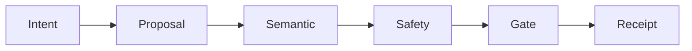

SAI VAP (SAI Verified Agent Protocol) ties four things into one chain: what the user authorized, what the agent proposed, what independent verifiers checked, and what actually executed.

Version 0.1. September 11, 2026. Working proposal, not a published standard. `MUST` / `MUST NOT` apply to an implementation of this text. The TypeScript package here is a reference, not an audit.

The path is:

authorized request → signed proposal → semantic check → safety check → gate → receipt

Each stage signs an attestation. The required set authorizes one action, with one payload digest. Participant keys are never combined or given to the agent.

A signature proves which key signed which bytes. It does not prove that an invoice is real, that a model is right, or that an RPC is honest. Bypass of the execution path is outside the guarantee.

Pages:

- **Roles** — who signs, and what they are forbidden to do
- **Flow** — mandate / intent, the three stages, the gate
- **Protocol** — objects and the hash binding
- **SDK and MCP** — packages and tools
- **Threat model** — substitution, replay, verifier shopping
