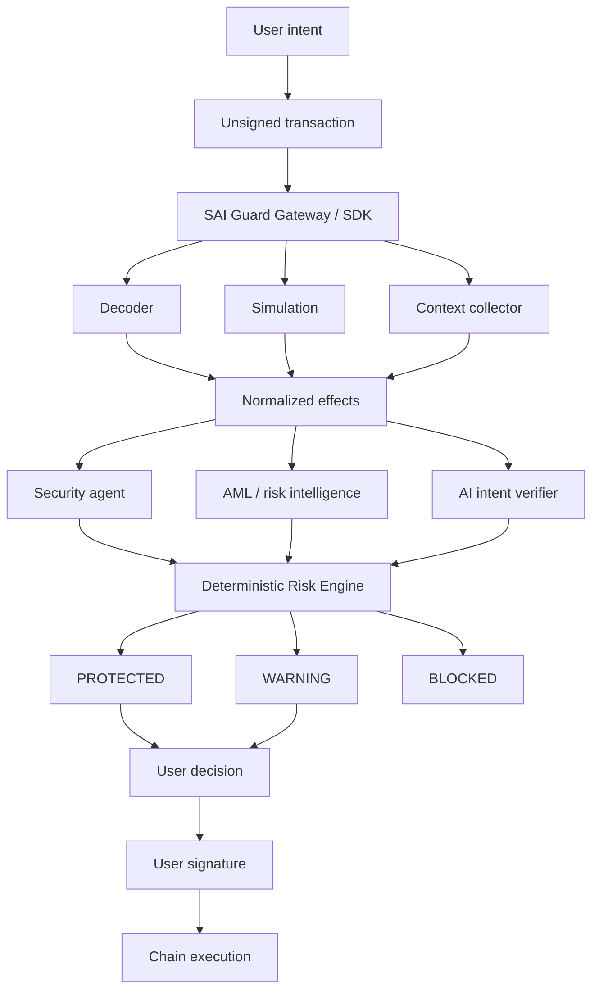

**SAI Guard Protocol** independently verifies a blockchain signing request against the user's explicit intent **before** the user authorizes it.

The wallet feature is [AI Transaction Protect](/reference/transaction-protect/): decode, simulate, explain, verdict, then wait for the user. The protocol does not manage portfolios or sign on the user's behalf.

This is a working protocol description, not a published standard and not an audit. Status labels throughout:

| Label | Meaning |
| --- | --- |
| **Available** | Present in the v0.1 TypeScript reference (`@sai-labs/vap`, HTTP API, MCP) |
| **In Development** | Target SAI Guard 2.0 protect flow; not the current runtime |
| **Proposed** | Architecture that is not implemented |

The v0.1 package is a hash-bound attestation and execution-gate demo for a frozen token transfer. The 2.0 model below is the product architecture. See [From v0.1](/reference/migration/).

## What SAI Guard is

Every blockchain transaction can be independently analyzed, simulated, verified against the user's original intent, and risk-checked before the user signs it.

```text
Intent → Analysis → Simulation → Independent Verification → Risk Decision → User Signature
```

SAI Guard performs **verification**. It does not decide what the user should invest in, rebalance portfolios, or trade on the user's behalf.

## What SAI Guard is not

| Not | Because |
| --- | --- |
| Autonomous asset management | The user remains the final authority over funds |
| Investment advice | Intent comes from the user, not from SAI Guard |
| A signing oracle | SAI Guard must not silently sign arbitrary transactions |
| An LLM security score | The Risk Engine is deterministic policy |
| Custody | Agent wallets pay for verification services, not user transfers |

Regulatory treatment depends on deployment, jurisdiction, custody, and what the integrating party offers. This document does not make licensing claims.

## Where it sits

```text
1. Transaction construction     wallet, dApp, or agent
2. Transaction verification     SAI Guard
3. Transaction authorization    user / user-authorized wallet
4. Transaction execution        chain adapter / broadcaster
```

Those four steps must stay separate. A WalletConnect session, an MCP tool, or an LLM that built the payload is not a substitute for step 2.

## The opaque-signing problem

Wallets still present calldata such as:

```text
0xa9059cbb000000000000...
```

or a WalletConnect request the user cannot decode. The user often cannot tell:

- which assets leave the wallet;
- which assets arrive;
- which contracts receive approvals, and whether they are unlimited;
- whether hidden internal calls run;
- whether the origin is a phishing app;
- whether the destination is flagged;
- whether the payload matches what they asked for.

SAI Guard's job is to turn that signing request into a verified, human-readable execution outcome, then return **PROTECTED**, **WARNING**, or **BLOCKED**.

## Core product flow

**In Development**

```text
User Intent
    ↓
Unsigned Transaction / Signing Request
    ↓
SAI Guard Protocol
    ↓
Transaction Decode
    ↓
Deterministic Simulation
    ↓
Security Intelligence
    ↓
AML / Sanctions / Reputation Checks
    ↓
Independent AI Intent Verification
    ↓
SAI Deterministic Risk Engine
    ↓
PROTECTED / WARNING / BLOCKED
    ↓
User Reviews Results
    ↓
User Signs
    ↓
Blockchain Execution
```



## Worked example

User intent:

```text
Swap 1,000 USDT → ETH
Minimum received: 0.31 ETH
```

Simulation (normalized effects):

```text
USDT: -1,000
ETH: +0.3231
Approvals: none
Unexpected transfers: none
```

Result:

```text
PROTECTED
Transaction matches your intent.
Amount verified · contracts verified · simulation succeeded
No unexpected approvals or transfers
Security and AML/sanctions checks passed
```

A different simulation that drains an extra token, or sets unlimited allowance, is **BLOCKED** even if an LLM caption said “swap”.

## Reading order

1. [Why SAI Guard](/reference/why-vap/)
2. [Architecture](/reference/architecture/)
3. [Three-layer verification](/reference/verification/)
4. [Risk Engine](/reference/risk-engine/)
5. [Protect Agent](/reference/protect-agent/)
6. [Arc](/reference/arc/) — optional settlement for verification services, not the user's transaction chain
7. [SDK](/reference/sdk/) and [HTTP API](/reference/api/)
