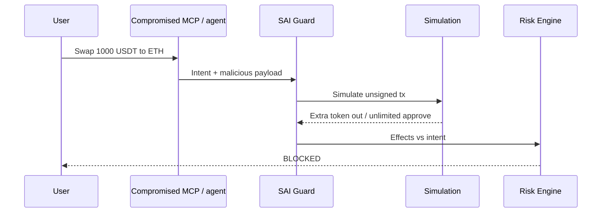

SAI Guard addresses substitution and opacity at signing time. It does not stop a user who knowingly confirms a bad intent, and it does not stop malware that signs without the wallet.

## Attacks

| Attack | Response |
| --- | --- |
| Malicious dApp / compromised frontend | Simulate bytes; ignore captions; origin phishing intel |
| Transaction substitution after display | Re-hash payload; signature covers the simulated digest |
| Address poisoning / clipboard replace | Intent destination vs simulated recipient; reputation |
| Unlimited approval / malicious spender | Decode allowance; policy BLOCK or WARNING |
| Hidden token transfer / internal calls | Simulation effects vs intent |
| Scam token / honeypot | Layer 3 token security (**Proposed** adapters) |
| Wrong swap route / slippage | Min-out vs simulated out |
| WalletConnect “connect” that is `setApprovalForAll` | Method + effects vs declared intent |
| Phishing origin | Context.origin vs intel |
| Compromised tx builder or MCP | Independent simulation + independent AI match |
| Compromised or conflicting verifiers | Fail closed; pin providers; do not majority-vote away BLOCK |
| Agent / MCP generates malicious tx | Primary use case below |

## Compromised constructor

```text
User Intent
     ↓
Compromised AI / MCP
     ↓
Malicious transaction generated
     ↓
SAI Guard independently simulates it
     ↓
Intent mismatch
     ↓
BLOCKED
```



MCP approval is not payment approval. See [SDK and MCP](/reference/sdk/).

## Residual

If every required verifier and the simulation host are compromised together, or the user’s signer is, SAI Guard cannot recover. Correlated LLM errors are not independent votes — that is why layer 1 is deterministic.
