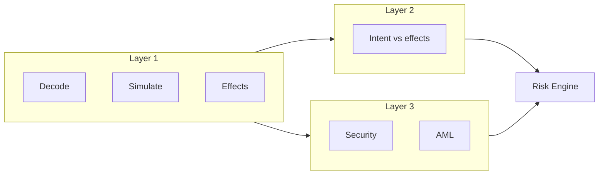

**In Development.** v0.1 maps loosely: decoder + gate ≈ layer 1; semantic attestation ≈ layer 2; safety attestation ≈ layer 3. v0.1 does not call external simulation or AML APIs.

## Layer 1 — Deterministic verification

No AI is required.

- decode calldata / instructions;
- method, recipient, transferred assets;
- token approvals, unlimited approvals, operator approvals;
- simulate or pre-execute;
- balance changes, internal calls;
- gas/energy estimate where applicable;
- revert / failure;
- compare deterministic expected values to intent where they are numeric and addresses.

Output: **normalized effects**.

```json
{
  "assetChanges": [
    { "asset": "USDT", "change": "-1000" },
    { "asset": "ETH", "change": "+0.3231" }
  ],
  "approvals": [],
  "unexpectedTransfers": [],
  "simulationSuccess": true
}
```

If simulation fails or cannot run, layer 1 does not invent PASS.

## Layer 2 — Independent AI intent verification

The model must **not** answer “is this transaction safe?”

It answers: does the simulated outcome correspond to the user’s explicit intent?

Feed structured fields, not raw chain dumps, whenever possible.

```json
{
  "intent": {
    "action": "swap",
    "fromAsset": "USDT",
    "fromAmount": "1000",
    "toAsset": "ETH",
    "minimumReceived": "0.31"
  },
  "effects": {
    "USDT": "-1000",
    "ETH": "+0.3231"
  },
  "approvals": []
}
```

```json
{
  "verdict": "MATCH",
  "confidence": 0.99,
  "issues": []
}
```

Verdicts: `MATCH`, `MISMATCH`, `UNCERTAIN`. Confidence is not a user-facing score. `MISMATCH` is a hard input to the Risk Engine. The producer agent must not be this verifier.

## Layer 3 — External security and risk

Provider-independent interfaces, for example:

```text
SecurityProvider
AMLProvider
SimulationProvider
ReputationProvider
```

Possible capabilities: malicious address/contract, phishing, honeypot, token security, approval risk, reputation, AML, sanctions, fraud intel, extra simulation, analytics.

**None of these vendors are wired in the current repository.** Treat names as examples for adapters:

- GoPlus, Blockaid, Tenderly, TRM Labs, AMLBot, native RPC / full-node simulation.

Do not claim a live integration until the adapter exists. See [Providers](/reference/providers/).


